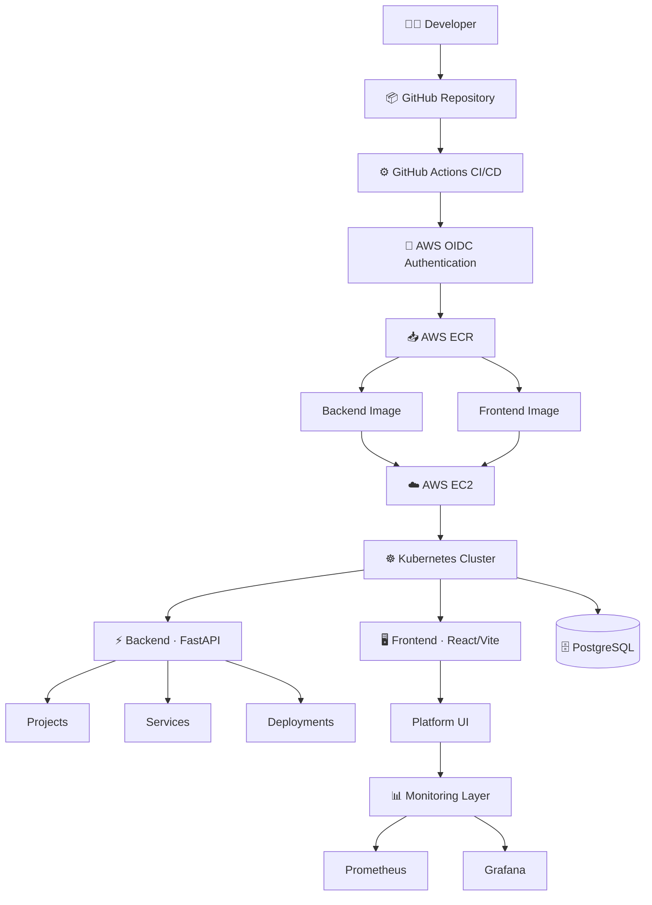
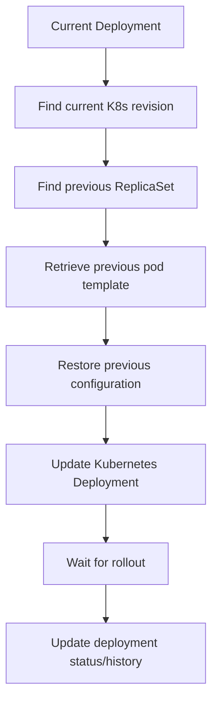
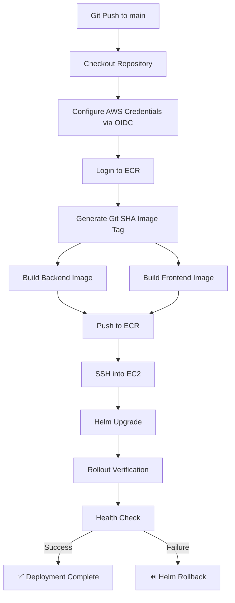

<div align="center">

# KubeStack — Cloud Native Microservices Platform

### Cloud-Native Kubernetes Microservices Platform

**A production-style platform for deploying, managing, scaling, monitoring, and rolling back microservices on Kubernetes — with fully automated CI/CD.**

[](#)
[](#)
[](#)
[](#)
[](#)
[](#)
[](#)
[](#)
[](#)
[](#)
[](#)

</div>

---

## Overview

**KubeStack** is a full-stack, cloud-native platform built to demonstrate the *complete lifecycle* of a modern microservices application — from code to cluster. It is not just a CRUD app wrapped in a UI; it's an end-to-end DevOps portfolio project that combines **application engineering**, **Kubernetes orchestration**, **infrastructure as code**, **observability**, and **automated deployment recovery** into a single, cohesive platform.

Through the KubeStack dashboard, you can create projects, register services, trigger deployments, **scale replicas on demand**, **roll back failed releases**, and **monitor cluster health in real time** — all without touching `kubectl` directly.

> The AWS environment used for validation was intentionally destroyed after testing to avoid ongoing cloud costs. All AWS/Terraform/ECR/EC2 work described below was **built, deployed, and verified** — screenshots and command outputs serve as evidence.

---

## Project Lifecycle

```mermaid
flowchart LR
    A[Application Foundation] --> B[React + FastAPI + PostgreSQL]
    B --> C[Dockerization]
    C --> D[Kubernetes Deployment]
    D --> E[Persistent Storage + RBAC]
    E --> F[Helm Packaging]
    F --> G[Scaling + Rollback]
    G --> H[Prometheus + Grafana]
    H --> I[Terraform AWS Infra]
    I --> J[AWS ECR]
    J --> K[GitHub OIDC]
    K --> L[GitHub Actions CI/CD]
    L --> M[Automated Verification]
    M --> N[Automated Rollback]
    N --> O[Infra Deprovisioned]
```



---

## High-Level Architecture



A more detailed component-level diagram — covering the frontend module tree, backend routing layers, ORM models, and Kubernetes runtime integration — is available at **`docs/architecture.png`**.

---

## Key Features

| Category | Capabilities |
|---|---|
| **Platform Dashboard** | Centralized UI for Projects, Services, Deployments & Monitoring |
| **Deployment Management** | Create deployments, track status, view history & replica state |
| **Dynamic Scaling** | Scale any deployment (1–10 replicas) directly from the UI |
| **Deployment Rollback** | One-click rollback to a previous Kubernetes ReplicaSet revision |
| **Kubernetes RBAC** | Scoped ServiceAccount permissions — least-privilege by design |
| **Persistent Storage** | PostgreSQL backed by a bound PersistentVolume/PVC |
| **Health Probes** | Readiness & liveness probes for reliable rollouts |
| **Helm Packaging** | Environment-specific values for dev, prod & AWS releases |
| **Observability** | Prometheus metrics + Grafana dashboards, surfaced in-app |
| **Cloud Deployment** | Terraform-provisioned AWS infrastructure (VPC → EC2 → ECR) |
| **CI/CD Automation** | GitHub Actions: build → push → deploy → verify → auto-rollback |
| **Keyless Cloud Auth** | GitHub OIDC → AWS IAM — zero long-lived credentials |

---

## Technology Stack

| Layer | Technology |
|---|---|
| **Frontend** | React, Vite, TailwindCSS |
| **Backend** | FastAPI, Python |
| **API** | REST / OpenAPI |
| **ORM** | SQLAlchemy |
| **Database** | PostgreSQL 16 |
| **Containerization** | Docker, Docker Compose |
| **Orchestration** | Kubernetes |
| **Package Management** | Helm |
| **Monitoring** | Prometheus, Grafana |
| **Infrastructure as Code** | Terraform |
| **Cloud Provider** | AWS (EC2, ECR, VPC, IAM) |
| **Container Registry** | Amazon ECR |
| **CI/CD** | GitHub Actions |
| **Cloud Authentication** | GitHub OIDC + AWS IAM |
| **Kubernetes Runtime** | containerd |
| **Local Kubernetes** | Minikube |

---

## Platform Walkthrough

### 🧭 Platform Overview

The KubeStack dashboard is the primary entry point — a centralized interface across Projects, Services, Deployments, and Monitoring.


### 📦 Deployment Management

Every deployment tracks its service, environment, version, status, and live replica count — all manageable through the UI instead of raw `kubectl` commands.


**Scaling API**

```http
POST /api/deployments/{deployment_id}/scale
```

- Accepts `replicas` in the range **1–10**
- Updates the underlying Kubernetes `Deployment` object in real time

### Kubernetes Deployment

Pods for the latest deployment, confirming successful scheduling across the `kubestack` namespace.


**Cluster verification**

```bash
kubectl get pods -n kubestack
kubectl get svc -n kubestack
kubectl get nodes
```


### Deployment Rollback

Rollback is one of the more advanced engineering pieces of KubeStack — it walks back a live deployment to a previous Kubernetes revision, safely and automatically.



```http
POST /api/deployments/{deployment_id}/rollback
```

✅ **Verified in a real test** — a deployment was rolled back from a newer version to a previous one, returning:

```json
{
  "message": "Deployment rollback completed",
  "deployment_id": "...",
  "previous_revision": "...",
  "rollback_revision": "...",
  "status": "successful"
}
```

### 🔐 Kubernetes RBAC

The backend's ServiceAccount is granted **only** the permissions it needs to perform rollback and scaling operations:

```yaml
apiGroups:
  - apps
resources:
  - replicasets
verbs:
  - get
  - list
  - watch
```

Verified with:

```bash
kubectl auth can-i list replicasets \
  --as=system:serviceaccount/kubestack:default \
  -n kubestack
# → yes
```

### ❤️ Health Probes

| Probe | Initial Delay | Period | Timeout | Failure Threshold |
|---|---|---|---|---|
| **Readiness** | 15s | 5s | 5s | 3 |
| **Liveness** | 30s | 10s | 5s | 3 |

### Helm & Release Management

The application is packaged with Helm at `helm/kubestack`, with environment-specific values for **dev**, **prod**, and **aws**.

```bash
helm install kubestack helm/kubestack -n kubestack
helm upgrade kubestack helm/kubestack -n kubestack
helm history kubestack -n kubestack
helm rollback kubestack -n kubestack
```


### 🐳 Containerization

Backend and frontend are independently containerized (`kubestack-backend`, `kubestack-frontend`), with Docker Compose used for local development.


### Backend API

Interactive API documentation is auto-generated via FastAPI's Swagger UI at `/docs`.


**Health endpoints**

```http
GET /health
GET /health/database
```

```json
{ "status": "healthy" }
{ "status": "healthy", "database": "postgresql" }
```

### Application Monitoring

The frontend's Monitoring page surfaces CPU usage, memory usage, pod restarts, and replica availability — powered by Prometheus — without requiring direct cluster access.


**Grafana dashboards**


### ☁️ AWS Deployment

Two dedicated ECR repositories store versioned, commit-tagged images:

```
kubestack-backend
kubestack-frontend
```

```
Git Commit → Commit SHA → Docker Image Tag → ECR → Kubernetes Deployment
```


The application was deployed to a single-node Kubernetes control-plane on **AWS EC2** (`ap-south-1`), provisioned entirely via **Terraform**, and exposed externally on **NodePort `30517`**.

> The AWS deployment was provisioned and validated successfully as part of the project implementation. The temporary AWS infrastructure was deprovisioned after validation to avoid unnecessary cost.

---

## 🔁 CI/CD Pipeline




**Keyless cloud authentication**

```
GitHub Actions → OIDC → AWS IAM Role → ECR
```

No long-lived AWS access keys are stored in the repository. The IAM role (`kubestack-github-actions-role`) trust policy is scoped to this specific repository and the `main` branch only.

---

## Engineering Challenges & Solutions

| Challenge | Solution |
|---|---|
| ARM64 images built locally were incompatible with the x86_64 AWS runtime | Rebuilt images explicitly for `linux/amd64` before pushing to ECR |
| GitHub Actions initially failed to assume the AWS IAM role | Corrected the GitHub OIDC trust relationship, scoped to the `main` branch |
| Deployment rollback required Kubernetes ReplicaSet access | Explicitly configured RBAC for `get`/`list`/`watch` on ReplicaSets |
| PostgreSQL data needed to survive pod restarts | Configured a static PersistentVolume + PVC with `ReadWriteOnce` / `Retain` |

---

## Security Considerations

- ✅ No AWS credentials hardcoded in the repository
- ✅ GitHub Actions authenticates via **OIDC**, not static AWS access keys
- ✅ Kubernetes RBAC scoped to least-privilege access
- ✅ Secrets managed via Kubernetes Secrets / GitHub Secrets
- ✅ Sensitive Terraform values excluded via `.gitignore`
- ✅ AWS resources destroyed after validation to eliminate residual attack surface

---

## 📂 Project Structure

```
kubestack/
├── docker-compose.yml
├── backend/
│   ├── Dockerfile
│   ├── requirements.txt
│   └── app/
│       ├── main.py
│       ├── database.py
│       ├── api/            → projects, services, deployments, monitoring
│       ├── models/         → SQLAlchemy models
│       └── schemas/        → Pydantic schemas
├── frontend/
│   ├── Dockerfile
│   ├── package.json
│   ├── vite.config.js
│   └── src/
│       ├── App.jsx
│       ├── main.jsx
│       ├── pages/          → Projects, Services, Deployments, Monitoring
│       └── services/api.js
├── helm/kubestack/
│   ├── Chart.yaml
│   ├── values*.yaml        → dev, prod, aws
│   └── templates/          → backend, frontend, postgres, RBAC
├── infrastructure/
│   ├── kubernetes/         → backend, frontend, postgres manifests
│   └── terraform/          → vpc, subnets, ec2, ecr, iam, security
├── monitoring/
│   ├── prometheus/prometheus.yml
│   └── grafana/kubestack-dashboard.json
└── .github/workflows/deploy.yml
```

---

## Getting Started (Local Development)

### 1️⃣ Run with Docker Compose

```bash
git clone https://github.com/sahilsingh12221802/KubeStack-Cloud-Native-Microservices-Platform.git
cd KubeStack-Cloud-Native-Microservices-Platform
docker-compose up --build
```

### 2️⃣ Run on Kubernetes (Minikube)

```bash
helm install kubestack helm/kubestack -f helm/kubestack/values-dev.yaml -n kubestack --create-namespace
```

### 3️⃣ Access locally via port-forward

```bash
kubectl port-forward svc/frontend 8080:80 -n kubestack
kubectl port-forward svc/backend 8000:8000 -n kubestack
```

| Service | URL |
|---|---|
| 🖥️ Frontend | http://localhost:8080 |
| 📘 Swagger Docs | http://localhost:8000/docs |
| ❤️ Health Check | http://localhost:8000/health |

---

## 🏆 Engineering Achievements

<table>
<tr>
<td valign="top" width="25%">

**Application**
- Full-stack React + FastAPI
- PostgreSQL persistence
- REST API & CRUD
- Service registry

</td>
<td valign="top" width="25%">

**Kubernetes**
- Deployments & Services
- Persistent storage
- Health probes
- RBAC & Scaling

</td>
<td valign="top" width="25%">

**DevOps**
- Docker & Compose
- Helm & Terraform
- AWS & ECR
- GitHub Actions + OIDC

</td>
<td valign="top" width="25%">

**Reliability**
- Readiness/liveness probes
- Automated rollback
- Helm release history
- Deployment verification

</td>
</tr>
</table>

---

<div align="center">

### Built as a complete DevOps & Cloud-Native portfolio project

*Development → Containerization → Kubernetes → Helm → Observability → AWS → CI/CD*

</div>
